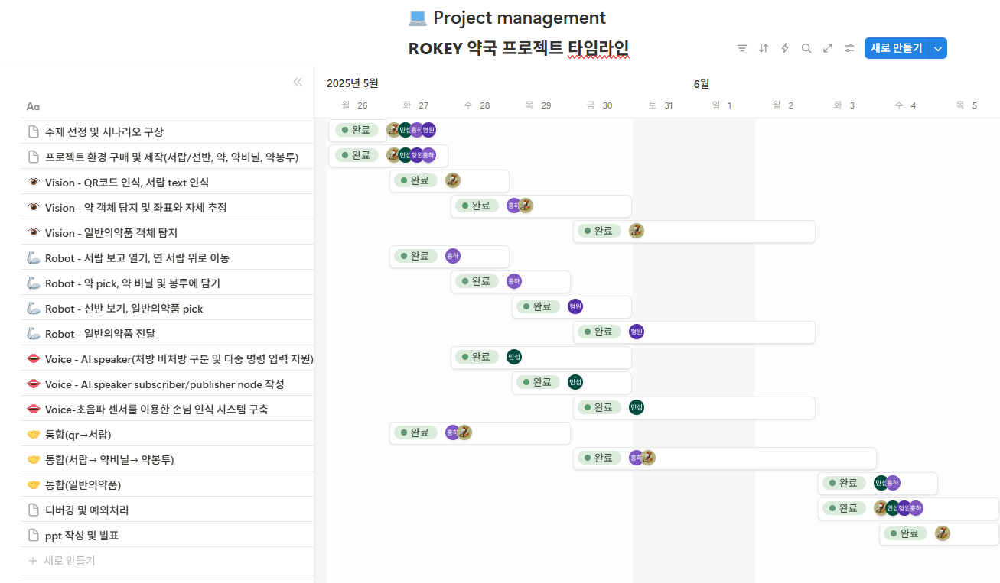
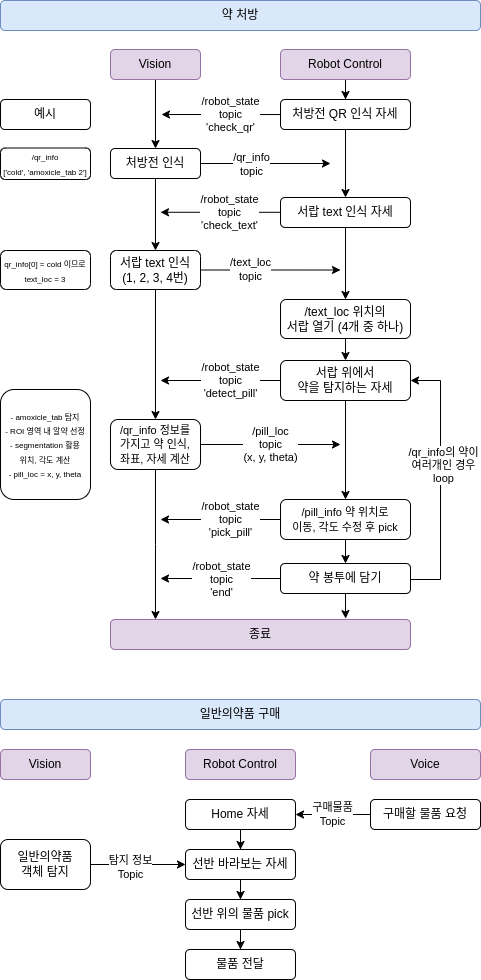
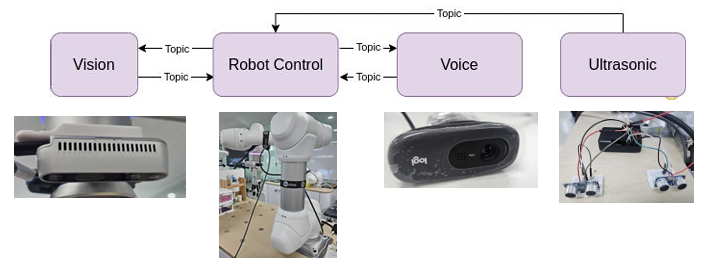

💊 Rokey_Pharmacy
===
ROKEY B-1조 협동-2 Project (AI기반 협동 로봇 작업 어시스턴트 구현 프로젝트)
---

### 🔗 출처 및 라이선스

이 프로젝트는 **두산로보틱스(Doosan Robotics Inc.)**에서 배포한 ROS 2 패키지를 기반으로 합니다.  
해당 소스코드는 [BSD 3-Clause License](https://opensource.org/licenses/BSD-3-Clause)에 따라 공개되어 있으며,  
본 저장소 또한 동일한 라이선스를 따릅니다. 자세한 내용은 `LICENSE` 파일을 참고하시기 바랍니다.

> ⚠️ 본 저장소는 두산로보틱스의 공식 저장소가 아니며, 비공식적으로 일부 수정 및 구성을 포함하고 있습니다.  
> 공식 자료는 [두산로보틱스 공식 홈페이지](http://www.doosanrobotics.com/kr/)를 참고해 주세요.   
> github (https://github.com/DoosanRobotics/doosan-robot2)
---
### 🔨 개발환경
본 프로젝트는 Ubuntu 22.04 (ROS2 humble) 환경에서 개발되었습니다.   
&nbsp;

### 🦾 작업공간
</img>   
&nbsp;

### 💻 코드 실행
```bash
ros2 run
```

---
&nbsp;

## 1. 📘 프로젝트 개요
의료 현장에서 의사·간호사·약사 등의 인력 부족, 처방·조제·투약 등 여러 단계에서 발생하는 문제로 투약 사고가 발생하고 있습니다. 이는 환자의 안전에 위해가 되는 만큼, 업무 효율화를 통한 안전한 투약 환경을 만들 필요가 있습니다.   
따라서 본 프로젝트에서는, 로봇 매니퓰레이터와 AI 비전 기술을 활용하여 약 조제를 자동화하는 시스템을 만들어 의료진의 업무 부담을 덜고, 의료 사고 발생율을 줄이고자 합니다.   

### **프로젝트 목표**
1. **약 조제 오류로 인한 사고 방지**   
AI Vision 기술을 활용한 약 분류 및 조제로 안정성 향상   
2. **의료 인력 부족 해결**   
약 조제의 자동화로 의료진 업무 부담 감소 및 인력 부족 문제 해결   
3. **고령화 대응**   
스스로 약을 복용하기 어려운 고령층을 위해 AI Voice를 활용한 음성 안내 서비스 제공

&nbsp;

## 2. 👥 프로젝트 팀 구성 및 역할분담
|이름|담당 업무|
|--|--|
|백홍하(팀장)|Vision(약 탐지, 좌표 추정), Robot 제어, ROS2 통신|
|서형원|Robot 제어(일반 의약품 전달)|
|정민섭|Voice(약 추천 및 설명), ROS2 통신, 초음파 센서 처리|
|정서윤|Vision(QR코드 인식, 약 탐지, 서랍 text 분류), 통합|

&nbsp;

## 3. 🗓 프로젝트 구현 일정
**진행 일자: 25.5.26(월) ~ 25.6.5(목) (11일)**
</img>

&nbsp;

## 4. 📌 SKILLS
### **Development Environment**
<div align=left>
  
  
  
</div>

[](https://skillicons.dev)

### **Robotics**
   
[](https://skillicons.dev)

### **Programming Languages**
   
[](https://skillicons.dev)

### **AI & Computer Vision**
<div align=left>
  
  
  
</div>

[](https://skillicons.dev) 

&nbsp;

## 5. 🤖 Hardware
### **Robot**
- Doosan Robotics m0609, OnRobot RG2 Gripper
### **Vision Camera**
- Intel RealSense D435i
### **SBC**
- Raspberrypi4 4gb
### **Mic**
- Logitech HD Webcam C270
### **Speaker**
- Blutooth speaker
### **Sensor**
- HC-SRO4 Ultrasonic Sensor

&nbsp;

## 6. 🎬 System Flow
</img>

&nbsp;

## 7. 🛠️ Node Architecture
</img>

&nbsp;

